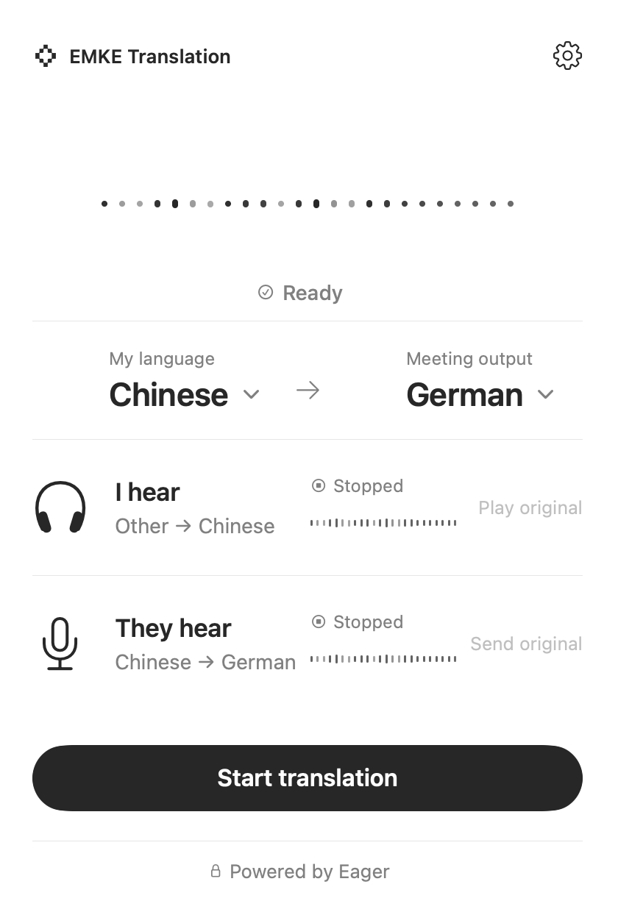
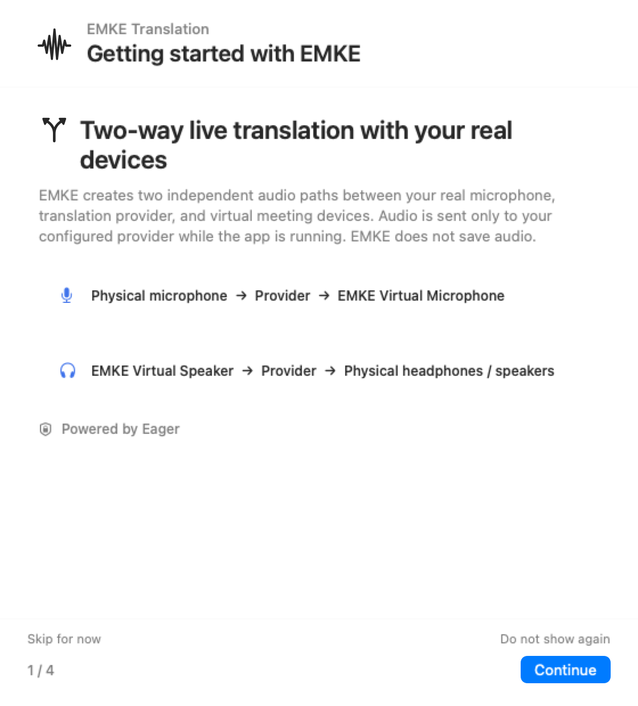

[简体中文](README.md) | English

<p align="center">
  
</p>

<h1 align="center">EMKE Translation</h1>

<p align="center">
  A two-way realtime translation app for the macOS menu bar, connecting your real audio devices, translation provider, and meeting app through two independent audio paths.
</p>

<p align="center">
  
  
  
  
</p>

## Product Preview

<p align="center">
  
  &nbsp;&nbsp;
  
</p>

<p align="center">
  
</p>

EMKE Translation is a two-way realtime translation client for the macOS 14+ menu bar. It connects to your configured realtime translation provider, uses your real microphone and headphones or speakers, and joins meeting apps through two EMKE virtual audio devices. API credentials stay in macOS Keychain, and EMKE does not save audio.

## Features

- **Independent two-way translation**: Inbound meeting audio and outbound microphone audio use separate sessions, with independent status, translation restore, and original-audio passthrough controls.
- **Virtual meeting devices**: Meeting apps connect through `EMKE Virtual Speaker` and `EMKE Virtual Microphone`, while EMKE continues using your real microphone and headphones or speakers.
- **Lightweight menu-bar experience**: The menu-bar dashboard controls languages and sessions; a non-activating floating capsule keeps translation status, waveform, and stop control visible.
- **Chinese and English interface**: Choose Follow System, Simplified Chinese, or English, with an expanded layout for longer English states.
- **First-launch onboarding**: Four steps explain privacy, microphone permission, local audio, provider connectivity, and meeting-device setup. You can skip it, dismiss it permanently, or reopen it from Settings.
- **Local diagnostics and connection checks**: Test the physical microphone, play a test tone, and inspect authentication, protocol handshake, target language, dual channels, transcription, audio output, and secure close.
- **Secure credentials and update checks**: The API key stays in macOS Keychain, and Sparkle provides in-app update checks.

## How It Works

**What you hear**

`Meeting app → EMKE Virtual Speaker → translation provider → physical headphones/speakers`

**What others hear**

`Physical microphone → translation provider → EMKE Virtual Microphone → meeting app`

The meeting app must select both EMKE virtual endpoints, while EMKE itself keeps the real hardware selected. Inbound and outbound channels can pass through original audio independently. Language, provider, and physical-device settings remain locked during an active translation and become editable after it stops.

## Getting Started

1. Complete first-launch onboarding, or reopen it from Settings. Grant microphone access only after reviewing the explanation.
2. Enter the Base URL, Model ID, and Keychain API key. Select and test the physical microphone and physical headphones or speakers.
3. In the meeting app, set the speaker to `EMKE Virtual Speaker` and the microphone to `EMKE Virtual Microphone`.
4. Choose My Language and Meeting Output from the menu-bar dashboard, then start translation.

## Requirements and Current Release

- macOS 14 or later
- Apple Silicon (arm64)
- Administrator authorization to install the app and virtual audio driver

> [v0.2.2](https://github.com/Halewwang/Simultaneous-interpretation/releases/tag/v0.2.2) is currently for internal evaluation only. The app and driver payloads are ad-hoc signed; the PKG itself is unsigned, not notarized by Apple, and is not a production public installer.

Sparkle can check for updates in the app, but a PKG containing the virtual audio driver still requires macOS administrator authorization. See the [internal package guide](Packaging/README.md) for build, verification, installation, and removal instructions.

## Local Development

```bash
swift run EMKEMenuBarApp
swift test
```

The SwiftPM executable is for local development verification only. It is not a signed or distributable macOS package.

## Privacy and Security

- The API key is stored in macOS Keychain, not in public settings or the repository.
- Audio is sent to your configured translation provider only while translation is running.
- EMKE does not save audio.
- Data retention, training, and compliance practices are governed by the third-party provider's own policies.
- Do not commit secrets, Authorization headers, real device inventories, recordings, or provider responses.

## Current Boundaries

The repository's Swift tests, deterministic interface renders, Release build, and package verification prove their respective automated code and artifact contracts.

They do not constitute Developer ID signing, Apple notarization, clean-Mac installation acceptance, or an end-to-end live meeting acceptance. Those checks require separate execution and evidence.

## Documentation

- [Internal package guide](Packaging/README.md)
- [Audio driver contract](docs/audio-driver-contract.md)
- [Local audio engine contract](docs/local-audio-engine-contract.md)
- [Translation coordinator contract](docs/translation-coordinator-contract.md)
