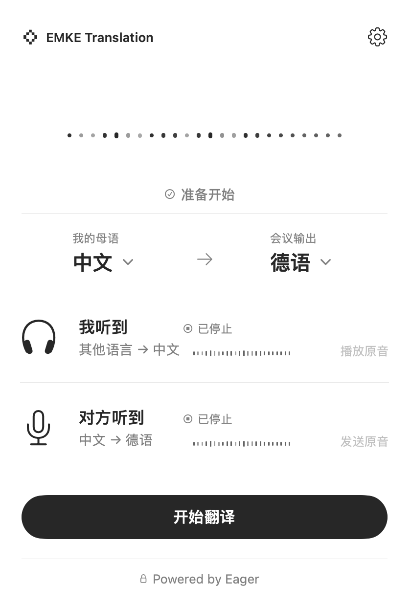
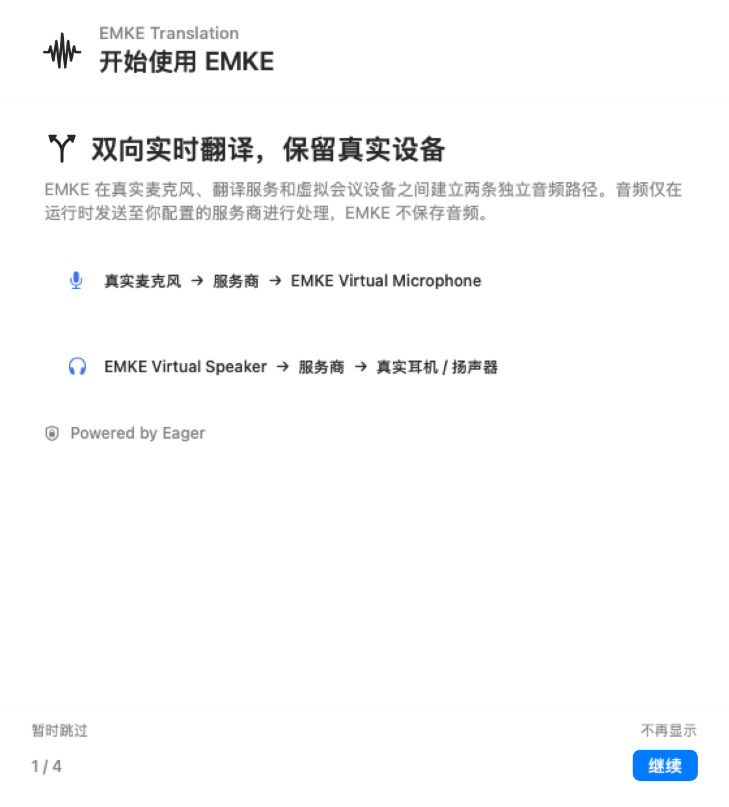

简体中文 | [English](README.en.md)

<p align="center">
  
</p>

<h1 align="center">EMKE Translation</h1>

<p align="center">
  面向 macOS 的菜单栏双向实时翻译，在真实音频设备、翻译服务与会议应用之间建立两条独立音频路径。
</p>

<p align="center">
  
  
  
  
</p>

## 产品预览

<p align="center">
  
  &nbsp;&nbsp;
  
</p>

<p align="center">
  
</p>

EMKE Translation 是面向 macOS 14+ 的菜单栏双向实时翻译客户端。应用连接你配置的实时翻译服务商，使用真实麦克风和耳机／扬声器，并通过两台 EMKE 虚拟音频设备接入会议应用。API 凭据保存在 macOS Keychain 中；EMKE 不保存音频。

## 核心功能

- **双向独立翻译**：入站会议音频与出站麦克风音频使用独立会话，可分别显示状态、恢复翻译或临时传递原音。
- **会议虚拟设备**：通过 `EMKE Virtual Speaker` 和 `EMKE Virtual Microphone` 接入会议应用，同时在 EMKE 内保留真实麦克风与耳机／扬声器。
- **轻量菜单栏体验**：菜单栏控制台负责语言与会话控制；非激活式悬浮胶囊持续显示翻译状态、波形与停止入口。
- **中英文界面**：支持跟随系统、简体中文和 English，并为英文长文案保留可读的扩展布局。
- **首次使用引导**：四步说明隐私、麦克风权限、本地音频、服务商连接和会议设备设置；可以暂时跳过、不再显示或从设置重新打开。
- **本地诊断与连接检查**：可测试真实麦克风、播放测试音，并检查认证、协议握手、目标语言、双通道、转写、音频输出和安全关闭。
- **安全凭据与更新检查**：API Key 只保存在 macOS Keychain；Sparkle 提供应用内更新检查。

## 工作原理

**你听到的声音**

`会议应用 → EMKE Virtual Speaker → 翻译服务商 → 真实耳机／扬声器`

**对方听到的声音**

`真实麦克风 → 翻译服务商 → EMKE Virtual Microphone → 会议应用`

会议应用需要同时选择两台 EMKE 虚拟设备，EMKE 内部则始终选择真实硬件。入站和出站通道可以独立传递原音；翻译运行期间，语言、服务商和物理设备设置保持锁定，停止翻译后才可修改。

## 开始使用

1. 完成首次引导，或从设置重新打开引导；阅读用途说明后再授予麦克风权限。
2. 填写 Base URL、Model ID 和 Keychain API Key，选择真实麦克风与真实耳机／扬声器，并完成本地音频测试。
3. 在会议应用中把扬声器设为 `EMKE Virtual Speaker`，把麦克风设为 `EMKE Virtual Microphone`。
4. 从菜单栏控制台选择“我的母语”和“会议输出”语言，然后开始翻译。

## 系统要求与当前版本

- macOS 14 或更高版本
- Apple Silicon（arm64）
- 安装应用和虚拟音频驱动时需要管理员授权

> [v0.2.0](https://github.com/Halewwang/Simultaneous-interpretation/releases/tag/v0.2.0) 当前仅供内部评估：应用与驱动 payload 使用 ad-hoc 签名，PKG 本身未签名、未经 Apple 公证，也不是可用于生产环境的公开安装包。

Sparkle 可以在应用内检查更新，但包含虚拟音频驱动的 PKG 仍需要 macOS 管理员授权。构建、验证、安装与卸载方式请参阅[内部安装包说明](Packaging/README.md)。

## 本地开发

```bash
swift run EMKEMenuBarApp
swift test
```

SwiftPM 可执行文件只用于本地开发验证，不是已签名或可分发的 macOS 安装包。

## 隐私与安全

- API Key 保存在 macOS Keychain，不写入公开设置或仓库。
- 只有翻译运行期间，音频才会发送到你配置的翻译服务商。
- EMKE 不保存音频。
- 第三方服务商的数据保留、训练和合规策略以该服务商自身政策为准。
- 不要把密钥、Authorization 头、真实设备清单、录音或服务商响应提交到仓库。

## 当前边界

仓库中的 Swift 测试、确定性界面渲染、Release 构建和安装包校验用于证明代码与产物满足各自的自动化契约。

这些结果不等同于 Developer ID 签名、Apple 公证、全新 Mac 安装验收或真实会议端到端验收；上述项目需要单独完成并记录。

## 相关文档

- [内部安装包说明](Packaging/README.md)
- [音频驱动契约](docs/audio-driver-contract.md)
- [本地音频引擎契约](docs/local-audio-engine-contract.md)
- [翻译协调器契约](docs/translation-coordinator-contract.md)
