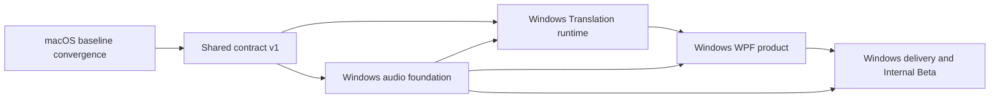

# EMKE Dual-Platform Program Implementation Plan

> **For agentic workers:** REQUIRED SUB-SKILL: Use superpowers:subagent-driven-development (recommended) or superpowers:executing-plans to implement this plan task-by-task. Steps use checkbox (`- [ ]`) syntax for tracking.

**Goal:** Establish independently developed, versioned, tested, and released macOS and Windows products while preserving shared translation and audio-safety semantics through versioned contracts.

**Architecture:** Complete one macOS baseline gate, publish `contractVersion = 1`, then run macOS and Windows as separate delivery tracks. macOS keeps its existing Swift/Core Audio stack and `vMAJOR.MINOR.PATCH` releases; Windows uses WPF/C#/C++/WDK and `windows-vMAJOR.MINOR.PATCH` releases. Platform-only work releases independently, while shared behavior changes must update the contract fixtures and pass both platform contract suites before either stable channel advertises the new contract.

**Tech Stack:** Swift 6.2, SwiftUI, AppKit, Core Audio, Sparkle 2.9.2, .NET 10, WPF, C++20, WASAPI/MMDevice, Visual Studio 2026, WDK 28000 family, CMake 4.2+, SYSVAD/WaveRT, MSIX, GitHub Actions

## Global Constraints

- Windows minimum OS is Windows 11 25H2, build 26200; the first Windows artifact is x64 only.
- Windows 10, Windows 11 24H2, and Windows ARM64 are outside the first release.
- macOS and Windows use independent branches, CI workflows, semantic versions, tags, update feeds, and release promotion decisions.
- Existing macOS tags remain `vMAJOR.MINOR.PATCH`; Windows tags are `windows-vMAJOR.MINOR.PATCH`.
- Shared behavior uses integer `contractVersion`; the first frozen version is `1`.
- macOS keeps SwiftUI/AppKit/Core Audio; Windows uses .NET 10/WPF/C++/WASAPI/WDK.
- Never send realtime Translation JSON as binary WebSocket frames; outbound protocol events are Text Frames.
- Network audio remains 24,000 Hz, mono, signed little-endian PCM16; normalized local audio remains 48,000 Hz stereo Float32.
- Inbound failure remains original-audio fail-open; outbound failure remains muted fail-closed.
- Audio, subtitles, API keys, and Authorization values never enter repository fixtures, release logs, or persistent application logs.
- Automated tests, package verification, installed-driver verification, live endpoint verification, real-meeting verification, and human listening are reported as separate evidence.
- Do not alter the user's dirty local `main`; implementation uses isolated worktrees created from verified refs.

---

## Plan Set

Execute these plans in dependency order:

1. [`2026-07-26-emke-macos-baseline-convergence.md`](2026-07-26-emke-macos-baseline-convergence.md)
2. [`2026-07-26-emke-shared-contract-v1.md`](2026-07-26-emke-shared-contract-v1.md)
3. [`2026-07-26-emke-windows-audio-foundation.md`](2026-07-26-emke-windows-audio-foundation.md)
4. [`2026-07-26-emke-windows-translation-runtime.md`](2026-07-26-emke-windows-translation-runtime.md)
5. [`2026-07-26-emke-windows-wpf-product.md`](2026-07-26-emke-windows-wpf-product.md)
6. [`2026-07-26-emke-windows-delivery-internal-beta.md`](2026-07-26-emke-windows-delivery-internal-beta.md)

Dependency graph:



After contract v1 is merged, future macOS-only and Windows-only work does not wait for the other platform. A change waits for both only when it modifies a shared contract file or a golden fixture.

### Task 1: Create Independent Execution Worktrees

**Files:**
- No product files change in this task.
- Verify: `.git/worktrees/`

**Interfaces:**
- Consumes: merged design commit and the latest verified `origin/main`.
- Produces: isolated execution worktrees with non-overlapping branch ownership.

- [ ] **Step 1: Verify the source refs**

Run:

```bash
git fetch origin --prune
git rev-parse --verify origin/main
git show --no-patch --oneline origin/main
git status --short --branch
```

Expected: `origin/main` resolves; the current design worktree contains only committed plan/design changes.

- [ ] **Step 2: Create the macOS baseline worktree**

Run from the repository root:

```bash
git worktree add \
  -b codex/macos-contract-v1 \
  ".worktrees/macos-contract-v1" \
  origin/main
```

Expected: `.worktrees/macos-contract-v1` is on `codex/macos-contract-v1`.

- [ ] **Step 3: Do not create downstream Windows worktrees yet**

Run:

```bash
git worktree list --porcelain
```

Expected: no `codex/windows-*` implementation branch exists until the exact completed `contract-v1` commit is known. This prevents Windows from silently forking an unfrozen behavioral baseline.

- [ ] **Step 4: Record the baseline branch identity**

Run:

```bash
git -C ".worktrees/macos-contract-v1" rev-parse HEAD
git -C ".worktrees/macos-contract-v1" status --short --branch
```

Expected: the recorded commit is the execution input for the macOS baseline plan.

### Task 2: Complete Gate G0 and Create the Contract Worktree

**Files:**
- No direct product changes in this task.
- Verify: commits produced by the macOS baseline plan.

**Interfaces:**
- Consumes: the clean completion commit from `codex/macos-contract-v1`.
- Produces: `codex/shared-contract-v1` rooted at the completed macOS baseline.

- [ ] **Step 1: Execute the macOS baseline plan**

Follow every checkbox in:

```text
docs/superpowers/plans/2026-07-26-emke-macos-baseline-convergence.md
```

Expected: the plan ends with one clean commit that contains the reviewed audio fixes and refreshed macOS evidence.

- [ ] **Step 2: Resolve and verify the completed baseline commit**

Run:

```bash
baseline_commit="$(git -C ".worktrees/macos-contract-v1" rev-parse HEAD)"
git -C ".worktrees/macos-contract-v1" status --porcelain
git show --no-patch --oneline "$baseline_commit"
```

Expected: status output is empty.

- [ ] **Step 3: Create the shared-contract worktree from that exact commit**

Run:

```bash
git worktree add \
  -b codex/shared-contract-v1 \
  ".worktrees/shared-contract-v1" \
  "$baseline_commit"
```

Expected: the shared-contract branch contains the completed macOS baseline, not the earlier `origin/main`.

- [ ] **Step 4: Execute the shared contract plan**

Follow every checkbox in:

```text
docs/superpowers/plans/2026-07-26-emke-shared-contract-v1.md
```

Expected: `Shared/Contracts/v1` and `Shared/TestVectors` are committed and macOS consumes them.

### Task 3: Start the Independent Windows Track

**Files:**
- No direct product changes in this task.
- Verify: the completed contract-v1 commit.

**Interfaces:**
- Consumes: a clean `codex/shared-contract-v1` completion commit.
- Produces: separate Windows branches rooted at the same contract commit.

- [ ] **Step 1: Resolve the contract commit**

Run:

```bash
contract_commit="$(git -C ".worktrees/shared-contract-v1" rev-parse HEAD)"
git -C ".worktrees/shared-contract-v1" status --porcelain
git show --no-patch --oneline "$contract_commit"
```

Expected: status output is empty.

- [ ] **Step 2: Create the Windows audio worktree**

Run:

```bash
git worktree add \
  -b codex/windows-audio-foundation \
  ".worktrees/windows-audio-foundation" \
  "$contract_commit"
```

- [ ] **Step 3: Execute and merge the Windows audio plan**

Follow:

```text
docs/superpowers/plans/2026-07-26-emke-windows-audio-foundation.md
```

Expected: driver and native audio tests pass on the Windows builder; no WPF product UI is required yet.

- [ ] **Step 4: Create the Windows runtime worktree from the reviewed audio commit**

Run:

```bash
audio_commit="$(git -C ".worktrees/windows-audio-foundation" rev-parse HEAD)"
git worktree add \
  -b codex/windows-translation-runtime \
  ".worktrees/windows-translation-runtime" \
  "$audio_commit"
```

- [ ] **Step 5: Execute and merge the Windows runtime plan**

Follow:

```text
docs/superpowers/plans/2026-07-26-emke-windows-translation-runtime.md
```

- [ ] **Step 6: Create and execute the Windows WPF product worktree**

Run:

```bash
runtime_commit="$(git -C ".worktrees/windows-translation-runtime" rev-parse HEAD)"
git worktree add \
  -b codex/windows-wpf-product \
  ".worktrees/windows-wpf-product" \
  "$runtime_commit"
```

Then follow:

```text
docs/superpowers/plans/2026-07-26-emke-windows-wpf-product.md
```

- [ ] **Step 7: Create and execute the Windows delivery worktree**

Run:

```bash
product_commit="$(git -C ".worktrees/windows-wpf-product" rev-parse HEAD)"
git worktree add \
  -b codex/windows-delivery-internal-beta \
  ".worktrees/windows-delivery-internal-beta" \
  "$product_commit"
```

Then follow:

```text
docs/superpowers/plans/2026-07-26-emke-windows-delivery-internal-beta.md
```

### Task 4: Enforce Independent Versions and Release Feeds

**Files:**
- Create: `Shared/Release/release-channels.json`
- Test: `Tests/EMKECoreTests/ReleaseChannelContractTests.swift`
- Test: `Windows/tests/EMKE.Contract.Tests/ReleaseChannelContractTests.cs`

**Interfaces:**
- Consumes: `contractVersion = 1`.
- Produces: stable tag/feed rules that prevent one platform from blocking or overwriting the other.

- [ ] **Step 1: Write the cross-platform release-channel fixture**

Create `Shared/Release/release-channels.json`:

```json
{
  "contractVersion": 1,
  "macos": {
    "tagPattern": "^v[0-9]+\\.[0-9]+\\.[0-9]+$",
    "feed": "appcast.xml"
  },
  "windows": {
    "tagPattern": "^windows-v[0-9]+\\.[0-9]+\\.[0-9]+$",
    "feed": "windows/internal/appinstaller"
  }
}
```

- [ ] **Step 2: Add macOS and Windows tests that load the same shared file**

The macOS test asserts:

```swift
#expect(document.contractVersion == 1)
#expect(try Regex(document.macos.tagPattern).wholeMatch(in: "v0.3.0") != nil)
#expect(try Regex(document.windows.tagPattern).wholeMatch(
    in: "windows-v0.1.0"
) != nil)
```

The Windows test asserts:

```csharp
Assert.IsTrue(Regex.IsMatch("v0.3.0", document.MacOS.TagPattern));
Assert.IsTrue(Regex.IsMatch(
    "windows-v0.1.0",
    document.Windows.TagPattern));
Assert.IsFalse(Regex.IsMatch(
    "windows-v0.1.0",
    document.MacOS.TagPattern));
```

- [ ] **Step 3: Run both contract suites**

Run on macOS:

```bash
swift test --filter ReleaseChannelContractTests
```

Run on Windows:

```powershell
dotnet test Windows/EMKE.Windows.slnx `
  --filter FullyQualifiedName~ReleaseChannelContractTests
```

Expected: both pass from the same JSON file.

- [ ] **Step 4: Commit the independent release rules**

```bash
git add Shared/Release/release-channels.json \
  Tests/EMKECoreTests/ReleaseChannelContractTests.swift \
  Windows/tests/EMKE.Contract.Tests/ReleaseChannelContractTests.cs
git commit -m "test: separate macOS and Windows release channels"
```

### Task 5: Final Program Gate

**Files:**
- Create: `docs/quality/dual-platform-evidence-template.md`
- Create: `docs/quality/dual-platform-release-checklist.md`

**Interfaces:**
- Consumes: outputs from all six implementation plans.
- Produces: an explicit proof boundary and independent promotion checklist.

- [ ] **Step 1: Create the evidence template**

Create `docs/quality/dual-platform-evidence-template.md`:

```markdown
# EMKE Platform Evidence

- Platform:
- App version:
- Driver version:
- Contract version:
- Commit:
- Package SHA-256:

## Automated
- Unit:
- Contract:
- Build:
- Package:

## Installed
- App installed:
- Driver installed:
- Virtual endpoints:

## Live
- Physical input/output:
- Meeting application:
- Inbound translation:
- Outbound translation:
- Fail-open:
- Fail-closed:
- Human listening:
```

- [ ] **Step 2: Create the release checklist**

Create `docs/quality/dual-platform-release-checklist.md`:

```markdown
# Dual-Platform Release Checklist

- [ ] Contract files are unchanged, or both platform contract suites pass.
- [ ] The target platform's unit/build/package gates pass.
- [ ] The other platform is not required for a platform-only release.
- [ ] App and driver versions are recorded independently.
- [ ] Installed proof is not inferred from package proof.
- [ ] Real-meeting proof is not inferred from automated tests.
- [ ] Release notes state the exact platform and channel.
```

- [ ] **Step 3: Verify no cross-platform tag collision**

Run:

```bash
git tag --list 'v*'
git tag --list 'windows-v*'
```

Expected: macOS and Windows tag namespaces do not overlap.

- [ ] **Step 4: Commit the program evidence rules**

```bash
git add docs/quality/dual-platform-evidence-template.md \
  docs/quality/dual-platform-release-checklist.md
git commit -m "docs: define independent platform release evidence"
```
