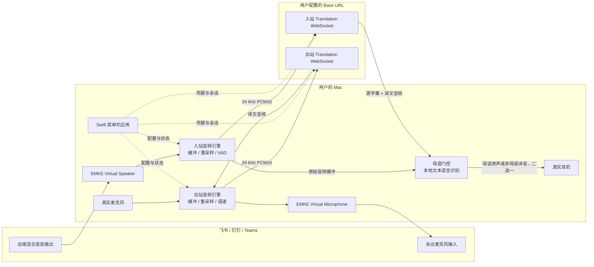

# EMKE Translation macOS 本地同声传译 MVP 设计

- 日期：2026-07-18
- 状态：等待用户书面复核
- 目标平台：Apple Silicon、macOS 14 及以上

## 1. 产品定义

EMKE Translation 是一个本地运行的 macOS 音频中间层。它不加入会议房间，也不要求钉钉、飞书或 Teams 提供专用接口；会议软件只会看到两个普通的 Core Audio 设备：`EMKE Virtual Speaker` 和 `EMKE Virtual Microphone`。

用户把会议软件的扬声器设为 `EMKE Virtual Speaker`，远端语音便先进入 EMKE：母语原声通过，非母语翻译后送到真实耳机。用户把会议软件的麦克风设为 `EMKE Virtual Microphone`，真实麦克风语音便先进入 EMKE，翻译后再以虚拟麦克风信号送进会议。其他参会者不需要安装 EMKE，也不会感知会议软件的工作方式发生变化。

MVP 不包含 Web 端。浏览器无法可靠地全局接管另一原生会议应用的输入、输出设备和系统音频路由，因此第一版采用原生 macOS 菜单栏应用加虚拟音频驱动。

## 2. 已确认的产品决策

| 主题 | MVP 决策 |
| --- | --- |
| 平台 | 仅 Apple Silicon、macOS 14+ |
| 运行形态 | 原生 Swift 菜单栏应用，不使用 Electron |
| 音频拦截与路由 | 完全在本机 Core Audio 层完成 |
| 模型推理 | 音频由客户端直接发送到用户配置的 OpenAI 兼容 Base URL |
| 账号系统 | 无登录、无订阅、无数据库、无 EMKE 业务服务器 |
| API 配置 | 用户自行填写 API Key、Base URL 和 Model ID |
| 凭据存储 | API Key 写入 macOS Keychain；其他配置写入本地偏好设置 |
| 入站规则 | 母语原声通过；服务商支持的其他语言自动翻译为母语 |
| 出站规则 | 真实麦克风语音翻译为用户选择的会议输出语言 |
| 会话 | 入站和出站使用两个相互独立的 Realtime Translation WebSocket 会话 |
| 入站失败 | Fail-open：自动播放原声，并在后台重连 |
| 出站失败 | Fail-closed：虚拟麦克风输出静音，用户可手动切换原声旁路 |
| 数据留存 | 不录音、不保存字幕、不做分析埋点 |
| 字幕 | 可选的短时悬浮字幕，仅驻留内存，关闭后立即清除 |
| 会议适配 | 通过标准音频设备兼容飞书、钉钉、Teams，不接入其 SDK |

## 3. 范围与非目标

### 3.1 MVP 范围

- 母语和出站目标语言的选择器首先提供中文、英文和德文。
- 入站允许模型自动识别其支持的其他语言，并尽力翻译成所选母语；MVP 的质量验收集中在中、英、德三种语言。
- 支持内置麦克风、USB 音频设备、有线耳机和常见蓝牙耳机。
- 提供连接测试、音频设备测试、翻译开关、入站原声旁路、出站手动旁路和状态提示。
- 输出语速提供 `0.9×`、`1.0×`、`1.1×` 三档本地调整。
- 只在当前 Host 与 Model 的内置兼容配置明确支持时显示可选输出声音；声音性别是服务商声音能力的展示属性，而不是 EMKE 自行推断或变声。

### 3.2 MVP 非目标

- Windows、iOS、Android 和 Web 客户端。
- EMKE 托管的房间服务器、媒体转发服务器、用户同步或集中计费。
- 离线翻译、本地大语言模型或本地完整语音识别模型。
- 声音克隆、任意音调变换或保证男性／女性声音可选。
- 会议录音、历史字幕、云同步、账号登录和订阅。
- 远端说话人分离、逐人字幕和重叠发言的可靠翻译。
- 针对飞书、钉钉或 Teams 的机器人、插件或会议 SDK 集成。
- 在 Base URL 不兼容时自动降级为“转写 → 文本翻译 → TTS”的多段链路。

## 4. 系统架构



这是“每用户本地 sidecar”架构。EMKE 不创建会议房间；每台 Mac 只为当前用户维护自己的两条模型连接。因此服务端资源需求不随会议房间数量集中增长，用户的并发、费用和限流由其 Base URL 服务商承担。

## 5. 本地组件边界

### 5.1 菜单栏应用

SwiftUI 负责设置、状态和字幕窗口；应用生命周期、音频控制和错误状态由独立的状态机管理。菜单栏图标必须能区分：未配置、就绪、连接中、翻译中、入站降级、出站静音、手动旁路。

### 5.2 Core Audio 虚拟设备

采用一个 Audio Server Driver Plug-in 发布两个命名清晰的设备：

- `EMKE Virtual Speaker`：会议软件向它写入远端播放音频，EMKE 应用从共享环形缓冲区读取。
- `EMKE Virtual Microphone`：EMKE 应用向共享环形缓冲区写入译文音频，会议软件把它当作麦克风读取。

音频实时线程只进行无锁缓冲区读写、格式转换和计时，不执行网络请求、JSON 解析、磁盘 I/O 或 UI 更新。应用异常退出时，虚拟麦克风默认输出静音，虚拟扬声器不得产生反馈环路。

Apple 当前文档将 Audio Server Driver Plug-in 作为构建纯虚拟音频设备的路径；AudioDriverKit 更适合真实硬件驱动，并需要额外的 DriverKit 授权。因此 MVP 不以 DriverKit 扩展作为首选实现。

### 5.3 音频引擎

入站和出站分别拥有独立的采集、重采样、抖动缓冲和播放管线。会议设备常见的 44.1/48 kHz 音频在本机转换为 Translation WebSocket 要求的 24 kHz 单声道 PCM16，返回音频再转换到实际输出设备格式。

设备切换、蓝牙采样率变化、睡眠唤醒和会议软件重新打开设备都由音频引擎重新协商，不能要求用户重启应用。

### 5.4 Translation Client

`TranslationClient` 只实现 OpenAI Realtime Translation 协议，不实现 Chat Completions、Responses、普通 Realtime voice-agent 协议或其他服务商私有协议。入站和出站客户端相互隔离，任何一条连接失败都不应终止另一条。

### 5.5 母语门控

`LanguageGate` 不做语音翻译。它利用 Translation 会话返回的 `session.input_transcript.delta`，通过 macOS 本地文本语言识别判断当前话语是否为用户母语，并在两个已缓冲候选音频之间选择：原始音频或翻译音频。

该组件不保存文本。一次话语结束、超时或应用退出后，相关原音、译音和字幕缓冲立即释放。

## 6. 语言行为

### 6.1 入站

以“我的母语 = 中文”为例：

- 中文话语：播放延迟后的中文原声，丢弃模型生成的中文音频。
- 英文、德文或服务商支持的其他非中文话语：只播放中文译音，丢弃原声。
- 无法可靠判断的极短话语：优先播放译音，避免漏掉外语内容。
- 本地 VAD 判定为音乐、会议提示音或其他非语音，且服务端没有返回源字幕时：播放延迟后的原声，不强行生成译音。

入站音频必须始终“原声或译音二选一”。不得先播放外语原声，再播放译文，也不得同时叠加两路。

### 6.2 母语判断算法

1. 入站音频连续发送给 Translation 会话，包括短暂停顿；本地 VAD 同时划分可播放的话语缓冲。
2. 原始音频和返回的译文音频在做出语言决定前都只进入内存缓冲，不立即播放。
3. 收到可用的源字幕增量后运行本地语言识别。母语置信度达到 `0.75` 时选择原声；任一非母语达到 `0.60` 时选择译音。
4. 如果在译音开始返回后的 `250 ms` 内仍无法分类，选择译音；如果本地 VAD 判定为非语音且服务端没有返回源字幕，则选择原声。
5. 决定一旦开始播放，在当前话语结束前不切换，避免一句话中发生声音跳变。

MVP 采用“话语级”决策。若一句话包含有意义的中外文混说，则整句话翻译为母语以保持语义连贯；人名、产品名和少量借词不单独触发切换。逐词拼接原声和译音不在 MVP 范围内。

因为语言判断来自同一 Translation 会话的源字幕，所有入站语音仍会发送给 Base URL，并可能产生模型费用；门控节省的是用户听感而不是 API 调用。若 Base URL 不返回源字幕增量，连接测试应判定其不满足 EMKE 入站要求。

### 6.3 出站

- 用户选择“会议输出语言”，例如德文。
- 真实麦克风音频持续发送到独立的出站 Translation 会话。
- 只把返回的德文译音写入 `EMKE Virtual Microphone`，会议软件不会收到用户的中文原声。
- 若母语和会议输出语言相同，应用自动使用本地原声通道，不创建无意义的同语种翻译会话。
- MVP 假设用户主要使用所选母语发言；出站不增加第二套源语言门控。

## 7. Base URL 与协议兼容合同

设置页包含：

- API Key
- Base URL
- Model ID，默认 `gpt-realtime-translate`
- “测试连接”按钮

Base URL 表示包含版本路径的 API 根地址，默认值为 `https://api.openai.com/v1`。应用将 `https` 转换为 `wss`，并追加 `/realtime/translations?model=<Model ID>`。例如默认地址会得到：

`wss://api.openai.com/v1/realtime/translations?model=gpt-realtime-translate`

自定义网关必须兼容以下协议能力：

- `Authorization: Bearer <API Key>` 鉴权；
- Translation WebSocket 握手；
- `session.update` 中的 `audio.output.language`；
- `session.input_audio_buffer.append` 的 24 kHz PCM16 Base64 音频；
- `session.output_audio.delta`；
- `session.input_transcript.delta` 和 `session.output_transcript.delta`；
- `session.close` 与 `session.closed`；
- 同一个 Key 至少允许两个并发 Translation 会话。

“兼容 OpenAI Chat API”不等于兼容该 Translation 协议。测试连接必须分别验证鉴权、会话创建、目标语言设置、音频往返、源字幕事件和关闭流程。任何一项失败都要指出具体不兼容项，不能把错误笼统显示为“Key 无效”。

MVP 不自动探测或切换到其他 API 链路。这样可以维持可预测的延迟、成本和错误语义。

## 8. 声音与语速

OpenAI 当前公开的 Realtime Translation 指南明确了目标语言，但没有公开承诺声音性别、任意音调或语速参数。因此：

- `1.0×` 为默认输出；`0.9×` 和 `1.1×` 由本地低延迟时间伸缩完成。
- 应用维护按 Host 与 Model 区分的兼容配置。只有该配置包含经过互操作测试的 Translation 声音字段，且测试连接确认服务端接受它时，设置页才显示对应声音列表；未知的自定义 Base URL 只使用服务商默认声音。
- 用户界面优先显示声音名称和试听；只有服务商明确提供性别标签时才显示“男性／女性”。
- 不根据声音主观听感猜测性别，不提供声音克隆或任意音调滑杆。
- 不支持的选项必须明确禁用，不能静默忽略用户设置。

## 9. 用户体验

### 9.1 首次设置

1. 安装并启用虚拟音频驱动。
2. 选择真实麦克风和真实耳机。
3. 填写 API Key、Base URL、Model ID，并运行连接测试。
4. 选择“我的母语”和“会议输出语言”。
5. 运行本地音频测试，确认耳机和虚拟麦克风都有电平。
6. 引导用户在会议软件中选择 `EMKE Virtual Speaker` 和 `EMKE Virtual Microphone`。

### 9.2 日常控制

菜单栏主面板仅保留：

- 开始／停止翻译；
- 我的母语；
- 会议输出语言；
- 入站状态与原声旁路；
- 出站状态、静音和手动原声旁路；
- API、音频设备和字幕入口；
- 当前延迟和明确的降级提示。

任何旁路状态都必须持续显示，避免用户误以为会议中的其他人仍在听译文。

### 9.3 字幕

可选悬浮窗显示当前源字幕和译文字幕。窗口只保留当前话语及很短的滚动上下文；文本只在内存中存在，关闭窗口或结束翻译时清空，不提供复制历史、搜索或导出。

## 10. 错误处理与安全状态

| 情况 | 系统行为 |
| --- | --- |
| 入站连接失败、超时或译音断流 | 当前缓冲到安全边界后切换为原声；后台指数退避重连；恢复后只在话语边界切回译音 |
| 出站连接失败、超时或译音断流 | `EMKE Virtual Microphone` 输出静音；显示强提醒；仅用户主动操作才允许原声旁路 |
| Base URL 缺少源字幕事件 | 连接测试失败，说明母语门控不可用，不允许进入“完全就绪”状态 |
| API Key 无效 | 保留本地配置但不记录 Key；显示鉴权错误和服务商响应状态 |
| 真实耳机断开 | 暂停入站播放并提示重新选择，禁止把声音意外切到外放 |
| 真实麦克风断开 | 出站静音并提示重新选择 |
| 虚拟驱动未安装或被禁用 | 提供修复入口，不启动网络会话 |
| 延迟超过阈值 | 显示“翻译延迟”状态；入站可手动旁路，出站保持译音或静音，由用户决定 |
| 应用崩溃或退出 | 虚拟麦克风静音；虚拟扬声器不回放缓存；不遗留录音或字幕文件 |

入站 fail-open 与出站 fail-closed 是不同的安全边界：听不懂时原声仍有价值，但把未经用户同意的原声发送给会议可能造成隐私或沟通风险。

## 11. 性能目标

以下是产品验收目标，不是对第三方 Base URL 的服务等级承诺：

- 非母语从讲话开始到首段译音：P50 不高于 `1.2 s`，P95 不高于 `2.5 s`。
- 母语原声在语言门控后的首段播放：P50 不高于 `0.8 s`，P95 不高于 `1.5 s`。
- 音频做出路由决定后的本地处理延迟：不高于 `100 ms`。
- 手动旁路生效：不高于 `100 ms`。
- 正常运行不得出现原声与译音双重播放、持续爆音、明显丢帧或音频反馈。
- Apple M1 基准机上，EMKE 活跃状态平均 CPU 目标低于单核 `15%`，常驻内存低于 `200 MB`。
- 安装包目标小于 `60 MB`；MVP 不捆绑大型本地语音模型。

延迟测试必须分别记录本地音频管线、网络往返、首个源字幕、首个译音和实际播放时间，不能只记录端到端总值。

## 12. 资源与成本模型

EMKE 没有房间服务器或中心媒体服务器。一次双向翻译通常对应用户设备到 Base URL 的两个并发会话：

```text
每位用户的会话数 = 1 条入站 + 1 条出站
系统集中房间资源 = 0
总模型用量 ≈ 所有用户实际发送的入站音频时长 + 出站音频时长
```

因此，不需要为会议房间预留大量 EMKE 服务器资源；但用户的 Key 必须具备足够并发和音频速率限额。当前 `gpt-realtime-translate` 按音频时长计费，价格和限流以用户所选 Base URL 的实时政策为准。应用只显示本次启用时长与连接状态，不估算账单。

## 13. 安全、隐私与分发

- API Key 只存储在 macOS Keychain，UI 默认遮挡，日志永不输出 Key 或 Authorization 头。
- Base URL、Model ID、语言和设备选择存储在用户本地偏好设置。
- 音频从用户 Mac 直接发送到其配置的 Base URL；EMKE 不代理、缓存或转发到自己的服务器。
- 首次使用自定义 Base URL 时明确提示：音频和字幕将发送给该域名，并显示完整主机名供确认。
- 不写入录音、源字幕、译文字幕或模型音频文件；诊断日志只记录时间、状态码、错误类别和延迟。
- 应用只申请真实麦克风权限；因为会议软件主动把音频输出到虚拟设备，不依赖全系统屏幕录制来抓取会议音频。
- 通过签名和公证的 `.pkg` 安装菜单栏应用与 `/Library/Audio/Plug-Ins/HAL` 驱动，安装和卸载需要管理员授权。
- 安装器必须说明可能需要重新启动 Core Audio 或重启 Mac，并提供完整卸载路径。
- 该分发形态以站外签名安装包为目标，不以 Mac App Store 为 MVP 发布渠道。

## 14. 验收与测试

### 14.1 核心功能

- 母语为中文时，英文和德文只播放中文译音，中文只播放延迟后的原声。
- 母语为英文时，中文和德文只播放英文译音，英文只播放延迟后的原声。
- 出站目标为德文时，会议软件只能收到德文译音，不能收到中文原声。
- 母语和出站目标相同时，出站自动使用本地原声路线；入站仍按母语门控规则处理其他语言。
- 中外文混说按整句话翻译，不发生逐词声音跳变。
- 极短语句、姓名、数字、日期、货币、电话号码、口音和快速语速均进入专项黄金样本测试。

### 14.2 协议与故障

- 使用可控的假 WebSocket 服务验证乱序事件、慢响应、断线、重连、无源字幕、错误音频格式和正常关闭。
- 分别验证入站 fail-open、出站 fail-closed 和两种手动旁路。
- 验证一条会话失败不会终止另一条。
- 验证 API Key、Base URL 和 Model ID 的错误分别给出不同反馈。
- 验证结束会话时先发送 `session.close`，等待 `session.closed`，不丢弃尾部译音。

### 14.3 音频与会议软件

- 在飞书、钉钉和 Teams 中分别选择两个 EMKE 设备并完成双向通话。
- 验证内置设备、USB、有线耳机、AirPods／蓝牙设备和 44.1/48 kHz 切换。
- 验证睡眠唤醒、耳机插拔、会议重连、应用重启、驱动重载和系统默认设备变化。
- 验证没有监听回路、回声放大、原译音重叠或外放泄漏。

### 14.4 隐私与分发

- 搜索应用容器、日志和临时目录，确认没有录音或字幕残留。
- 验证 Keychain 之外没有明文 API Key。
- 在干净的 macOS 14 和后续受支持版本上完成安装、授权、升级和卸载。
- 验证未配置或驱动损坏时不会静默占用用户的会议音频。

## 15. 已知限制

- 飞书、钉钉和 Teams 通常向一个输出设备提供已经混合的远端音频。多人重叠发言时，EMKE 无法恢复独立说话人轨道，翻译质量会下降。
- “所有其他语言”实际指 Base URL 所选模型支持的语言；MVP 只对中、英、德给出明确质量验收，不承诺世界上每种语言。
- 母语门控依赖源字幕和本地文本语言识别。极短话语、同形词和强代码混说可能被误判；默认策略是疑似外语时优先播放译音。
- 为避免先听原声再听译音，原声和译音都需要短暂缓冲；母语原声会比普通会议播放略有延迟。
- 第三方 Base URL 即使兼容普通 OpenAI API，也可能不兼容 Realtime Translation、源字幕事件或两个并发会话。
- 当前公开 Translation 协议未保证声音性别、音调和语速控制；MVP 只保证本地三档语速，声音选择取决于服务商能力。
- 蓝牙设备的系统编解码、采样率切换和无线延迟不受 EMKE 完全控制。
- 没有网络或模型服务不可用时，EMKE 只能按入站原声、出站静音／手动原声旁路运行，不能离线翻译。

## 16. 官方依据

- [OpenAI Realtime Translation](https://developers.openai.com/api/docs/guides/realtime-translation)：独立 Translation 会话、WebSocket 流、24 kHz PCM16、目标语言配置、输入／输出字幕事件和关闭流程。
- [GPT-Realtime-Translate 模型](https://developers.openai.com/api/docs/models/gpt-realtime-translate)：流式语音到语音翻译模型、专用 Translation 端点和按音频时长计量。
- [Apple：Creating an Audio Server Driver Plug-in](https://developer.apple.com/documentation/coreaudio/creating-an-audio-server-driver-plug-in)：macOS 虚拟音频设备实现路径。
- [Apple：Creating an audio device driver](https://developer.apple.com/documentation/AudioDriverKit/creating-an-audio-device-driver)：AudioDriverKit 与虚拟设备实现边界及授权要求。
