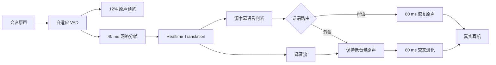

# EMKE Translation 实时音频稳定性优化 PRD

- 日期：2026-07-29
- 状态：已在对话中确认，待书面审阅
- 实施基线：`4892578`（v0.2.3 / PR #3 合并提交）
- 目标仓库：`https://github.com/Halewwang/Simultaneous-interpretation.git`
- 目标平台：Apple Silicon、macOS 14 及以上
- 本轮方案：稳定性基线 + 低音量原声预览 + 交叉淡化 + 自适应 VAD

## 1. 产品背景

EMKE Translation 通过两个独立的 Realtime Translation WebSocket 会话处理
入站和出站语音，并通过本地虚拟音频设备接入飞书、钉钉和 Teams。

v0.2.3 已完成以下稳定性修复：

- 入站与出站会话独立握手和独立重连；
- 握手完成前的音频不会发送给 Translation 会话；
- 重连时丢弃上一连接遗留的不足一帧 PCM；
- `zh-Hans`、`zh-Hant` 等标签按主语言聚合；
- VAD 结束后保留 500 ms 译音尾部，并由晚到增量延长；
- 24 kHz 到 48 kHz 的译音使用连续插值。

现有合同仍存在四个影响会议体验的问题：

1. 入站原声必须等待语言门控后才开始播放，首句容易出现明显无声等待；
2. 上行固定使用 200 ms 分帧，语音开始后天然需要等待较大的首帧；
3. 固定 RMS VAD 阈值无法适应安静房间、空调噪声和不同输入增益；
4. 重连任务和接收任务没有协调器级通道 epoch，存在旧连接晚到事件污染新连接
   的结构性风险。该风险不是已复现缺陷，但应在继续增加异步音频状态前消除。

本轮通过低音量原声预览降低“完全没有声音”的主观等待，同时保持话语级路由
锁定；通过小分帧、自适应 VAD、通道 epoch 和分段延迟指标缩短并定位真实延迟。

## 2. 产品目标

- 入站语音开始后立即提供可听但不喧宾夺主的原声反馈。
- 母语话语平滑恢复为全音量原声，不从句首重新播放。
- 外语话语在译音到达时平滑切换，不出现爆音或同一话语反复切换。
- 入站失败继续 fail-open，出站失败继续 fail-closed。
- 将本地首帧等待从固定 200 ms 降低到可验证的 40 ms。
- 让 VAD 随环境噪声变化，同时保留首音节和尾音。
- 隔离重连前后的字幕、音频和完成事件。
- 记录不含音频、字幕、密钥和鉴权内容的分段延迟。
- 在界面上区分音频引擎、入站可听和出站可发言三种就绪程度。

## 3. 非目标

- 固定译音音色、选择男女声、声音克隆或自定义提示词。
- 改为“转写 → 文本翻译 → TTS”的多模型链路。
- 更换 Provider、默认 Base URL、默认 Model ID 或 Keychain 合同。
- 逐说话人建会话、说话人分离或重叠发言的可靠翻译。
- 修改 Windows 音频链路、驱动安装器、Sparkle 或发布签名流程。
- 保存录音、字幕历史或上传遥测。
- 承诺由第三方网络和模型决定的固定端到端翻译 SLA。

`gpt-realtime-translate` 的输出声音会随输入说话人动态适配。本轮不把标准 Realtime
API 的 `voice`、`speed`、`instructions` 等字段假定为 Translation 接口能力。

## 4. GitHub 同类项目调研与采用范围

| 项目 | 可验证的实现关注点 | 本项目采用方式 | 不直接采用的部分 |
| --- | --- | --- | --- |
| [openai/openai-cookbook Realtime Translation Guide](https://github.com/openai/openai-cookbook/blob/e65bbfc454036e38e27c863c13ff3b3996daed87/examples/voice_solutions/realtime_translation_guide.mdx) | 持续发送音频、按源说话人与目标语言组织 Translation 会话、动态声音适配 | 保持每个方向独立会话；网络层持续发送 24 kHz PCM16，包括静音；不暴露未经支持的固定音色设置 | 浏览器、Twilio 和 LiveKit 的媒体接入层 |
| [jamesrochabrun/SwiftOpenAI RealtimeExample](https://github.com/jamesrochabrun/SwiftOpenAI/blob/4edec2bba872d149abdb1091a8873b4c70d3b991/Examples/RealtimeExample/RealtimeExample.swift) | Swift 异步会话、事件流和持续追加音频 | 保持类型化事件和任务取消边界；通过 epoch 让异步任务只影响创建它的通道代际 | 直接替换现有 Translation 客户端或切换为普通 Realtime 协议 |
| [QuentinFuxa/WhisperLiveKit](https://github.com/QuentinFuxa/WhisperLiveKit) | VAD、增量处理和流式话语边界 | 借鉴独立、可配置的 VAD 边界；把噪声估计、启动、释放和尾部窗口分别测试 | Python 服务端、Whisper 推理和字幕稳定化栈 |
| [huggingface/speech-to-speech](https://github.com/huggingface/speech-to-speech) | 流式 STT/LLM/TTS 模块与队列隔离 | 借鉴分段时间戳、组件职责隔离和可替换的流式缓冲参数 | 多模型级联，因为会增加延迟、成本和失败点 |
| [ExistentialAudio/BlackHole](https://github.com/ExistentialAudio/BlackHole/blob/e2b22aaaba4e507a097131704bf96dabc004d9cf/BlackHole/BlackHole.c) | Core Audio 实时线程和按 sample time 处理环形音频 | 保持 HAL 回调只做有界音频操作；后续驱动专项可评估按 sample time 寻址 | 本轮不重写现有 EMKE 驱动环形缓冲 |
| [ictnlp/StreamSpeech](https://github.com/ictnlp/StreamSpeech) | 同声翻译中的质量与延迟权衡 | 把“首帧等待、本地处理、模型返回、播放调度”拆开测量，不用单一总耗时掩盖问题 | 训练、推理和评测模型栈 |

外部项目只提供边界和实现模式。EMKE 不复制其协议假设，也不以 GitHub 示例通过
替代 OpenAI、302AI、自定义 Base URL 或真实会议链路的有声验收。

## 5. 已确认的产品行为

### 5.1 入站原声预览

每个入站话语由新的 `utteranceID` 标识。检测到话语开始后：

1. 当前原声以 `0.12` 线性增益播放，约为 `-18.4 dB`；
2. 原声按当前时间点连续向前播放，不为了后续决策从句首重放；
3. Translation 会话继续接收同一条完整 PCM 流，包括静音；
4. 原声预览只改变真实耳机播放增益，不改变发送给模型的数据。

这一选择会让用户在语言判定前听到低音量外语原声。它是用少量原声暴露换取
首句即时反馈的已确认产品取舍。

### 5.2 母语话语

当字幕语言门控判定为母语：

- 当前话语锁定为 `original`；
- 从当前增益开始，在 80 ms 内线性恢复到 `1.0`；
- 已经以 12% 播放过的部分不重放；
- 当前话语后续译音和语言事件均不得改变路由。

### 5.3 外语话语

当字幕语言门控判定为非母语：

- 当前话语锁定为 `translation`；
- 原声继续以 12% 播放，直到首个可播放译音到达；
- 如果译音先于语言判定到达，先在有界内存中等待；
- 首个译音可播放时，80 ms 内将原声从当前增益降至 `0`，同时将译音从
  `0` 提升至 `1.0`；
- 交叉淡化结束后只播放译音，当前话语不得切回原声。

### 5.4 无法分类、失败和停止

- 语言决定期限沿用现有合同：译音开始返回 250 ms 后仍未分类时，语音默认译音，
  非语音默认原声。
- 入站翻译失败、断线、超时或话语结束时没有译音，立即从当前时间点恢复原声，
  恢复 ramp 为 80 ms，不回放已经错过的句首。
- 入站仍为 fail-open；任何一条入站异常都不能停止出站或本地音频引擎。
- 出站仍为 fail-closed；错误时虚拟麦克风保持静音，只有用户显式旁路才能发送
  原声。
- 应用停止时取消预览、ramp 和译音播放，清空当前话语状态，不在下一次启动复用。

## 6. 组件架构

### 6.1 `InboundAuditionController`

位置：`EMKECoordinator`。

这是纯 Swift、无 I/O 的话语级状态机。它拥有：

- 当前 `utteranceID`；
- 当前路由：`undecided`、`original` 或 `translation`；
- 原声当前增益；
- 是否已有可播放译音；
- 话语开始、结束、失败和路由锁定状态。

输入事件包括：

- 话语开始和结束；
- 原声 PCM；
- 母语或非母语决定；
- 译音 PCM 首包和后续包；
- Translation 不可用；
- 会话停止或 epoch 失效。

输出是播放指令，不直接写音频端点：

- 按指定增益播放原声；
- 对原声或译音执行指定时长 ramp；
- 播放、缓存或丢弃译音；
- 锁定当前话语路由；
- 清空当前话语。

协调器负责执行这些指令。状态机不依赖 WebSocket、HAL、UI 或系统时钟，因此可以
用确定性事件序列覆盖全部分支。

### 6.2 `PCM16GainRamp`

位置：`EMKECoordinator`。

该组件处理 24 kHz、单声道、signed little-endian PCM16：

- 80 ms 对应 1,920 个样本；
- 从调用时的当前增益逐样本线性变化到目标增益；
- 跨多个 PCM 块保持 ramp 进度；
- 新 ramp 从当前瞬时增益开始，不先跳回旧起点；
- 乘法结果饱和到 `Int16` 范围；
- 空数据和奇数字节输入返回显式错误。

增益处理在音频工作任务执行，不进入 HAL 实时回调。ramp 完成后不保留额外 PCM。

### 6.3 `AdaptivePCMVoiceActivityDetector`

位置：`EMKECoordinator`，替换当前固定阈值检测器。

输入继续使用 10 ms PCM16 块。生产默认参数：

| 参数 | 默认值 |
| --- | --- |
| 初始噪声底 RMS | `0.002` |
| 噪声底 EMA 系数 | `0.05` |
| 动态阈值倍数 | `3.0` |
| 阈值下限 | `0.006` |
| 阈值上限 | `0.030` |
| 启动 | 连续 2 个有声块，即 20 ms |
| 释放 | 连续 30 个静音块，即 300 ms |
| 译音尾部 | 至少 500 ms，并由晚到字幕或音频增量重新计时 |

噪声底只在非语音状态且当前 RMS 低于动态阈值时更新。进入语音状态后冻结噪声底，
避免持续说话把阈值推高。动态阈值按
`clamp(noiseFloor * 3.0, 0.006, 0.030)` 计算。

VAD 只负责话语和播放边界，不负责停止网络音频发送。

### 6.4 `TranslationLatencyTracker`

位置：`EMKECoordinator`。

每个匿名 `utteranceID` 记录单调时钟时间点：

- `speechStarted`；
- `firstNetworkFrameSent`；
- `firstSourceTranscriptReceived`；
- `routeDecided`；
- `firstTranslationAudioReceived`；
- `firstPlaybackScheduled`。

Tracker 只在内存中保留当前运行会话的有限样本和聚合值，停止时清空。不记录：

- PCM 或其他音频内容；
- 源字幕和译文字幕；
- API Key、Authorization 头或 Base URL 查询参数；
- 用户、会议、设备或说话人身份。

本轮只向诊断状态提供快照，不新增上传、磁盘日志或用户分析埋点。

### 6.5 通道 epoch

`TranslationCoordinator` 增加独立的 `inboundEpoch` 和 `outboundEpoch`：

- 每次创建新通道会话前递增对应 epoch；
- 停止或使当前通道失效时再次递增；
- 接收、发送、重连和关闭任务捕获创建时 epoch；
- 所有异步回调在修改状态、写音频或发布字幕前验证 epoch；
- 不等于当前 epoch 的事件静默丢弃。

入站和出站 epoch 永不共用。任一通道重连不得使另一通道任务失效。

### 6.6 可配置网络分帧

`PCMFrameBatcher` 从固定字节数改为按音频格式和时长计算：

- 40 ms：1,920 bytes；
- 200 ms：9,600 bytes；
- 只接受能形成完整 PCM16 样本的正数时长；
- 重连、停止和通道失效继续清除不足一帧的尾部。

开发和真实供应商探测优先使用 40 ms。公开发布默认值只有在 OpenAI/302AI 目标
Base URL 的有声探测通过后才切为 40 ms；否则保持 200 ms。单元测试只能证明本地
分帧正确，不能证明服务商接受该节奏。

## 7. 数据流

音频引擎、网络会话、语言门控和真实耳机写入仍由协调器编排。新状态机只决定
“播放什么以及用什么增益”，不会取得端点生命周期所有权。

## 8. UI 状态合同

现有单一连接状态拆成三个用户可理解的能力状态：

| 状态 | 成立条件 | 用户含义 |
| --- | --- | --- |
| 音频引擎已启动 | 四个本地端点已成功运行 | 本地音频链路已经工作 |
| 可以收听 | 入站会话 active，或入站处于 fail-open / 显式原声旁路 | 真实耳机能够收到译音或原声 |
| 可以发言 | 出站会话 active，或同语种本地直通 / 显式原声旁路 | 会议能够收到译音或用户授权的原声 |

连接中可以显示“音频引擎已启动”，但不能提前显示“可以发言”。出站失败必须持续
显示不可发言或静音状态。入站失败可以显示“可以收听原声”，不能显示为健康翻译。

本轮复用现有 Dashboard 和悬浮状态组件，不重新设计布局。

## 9. 错误处理

| 场景 | 行为 |
| --- | --- |
| 入站握手或运行失败 | 使入站 epoch 失效；原声从当前点以 80 ms ramp 恢复；后台按现有策略重连 |
| 出站握手或运行失败 | 使出站 epoch 失效；虚拟麦克风静音；保留用户显式旁路 |
| 译音在语言决定前到达 | 在当前话语有界缓冲中等待，直到路由锁定 |
| 外语已锁定但话语结束仍无译音 | 恢复当前原声，不重放句首，清空译音候选 |
| 母语锁定后晚到译音 | 丢弃译音，路由不切换 |
| 重连前的字幕或译音晚到 | epoch 不匹配，丢弃且不更新 UI |
| PCM 奇数字节或非法 ramp | 作为本地音频错误计数并丢弃该块，不将损坏数据写入端点 |
| 40 ms 供应商探测失败 | 发布配置回退 200 ms，不改变其他稳定性能力 |
| 应用停止 | 使两个 epoch 失效，取消任务，清空 ramp、VAD、指标和话语状态 |

## 10. 验收指标

| 维度 | 验收标准 |
| --- | --- |
| 原声预览 | 检测到语音后以 `0.12` 线性增益播放，不重复播放已听部分 |
| 母语路由 | 判定为母语后 80 ms 内从当前增益平滑恢复到 `1.0` |
| 外语路由 | 首个译音可播放后执行 80 ms 原声淡出和译音淡入 |
| 路由稳定性 | 单个 `utteranceID` 锁定后，晚到字幕、译音或重连事件不得切换路由 |
| 异常降级 | 入站失败时从当前原声恢复，不从句首重放；出站保持 fail-closed |
| 重连隔离 | 旧 epoch 的字幕、音频、完成和错误事件全部被丢弃 |
| 40 ms 首帧 | `speechStarted → firstNetworkFrameSent` P95 不高于 100 ms |
| 200 ms 回退 | 同一指标 P95 不高于 260 ms |
| 本地译音播放 | `firstTranslationAudioReceived → firstPlaybackScheduled` P95 不高于 50 ms |
| VAD 完整性 | 20 ms 启动、300 ms 释放、500 ms 尾部；验收语料不截断首音节或尾音 |
| UI 就绪语义 | 音频引擎、可收听、可发言三个状态独立且符合第 8 节 |

端到端翻译耗时只记录，不作为第三方 Provider 的固定 SLA。性能报告必须同时给出
网络分帧、本地调度和服务端返回阶段，不能只报告一个无法归因的总耗时。

## 11. 测试矩阵

### 11.1 确定性单元测试

- `InboundAuditionController` 的母语、外语、未决、失败、停止和路由锁定路径；
- 译音早于或晚于语言决定的两种顺序；
- `PCM16GainRamp` 的增益、跨块连续性、80 ms 样本数、饱和和非法输入；
- 自适应 VAD 在安静、持续噪声、突发噪声和语音尾部下的边界；
- 40 ms 和 200 ms 分帧、跨 append 尾部、重连清空和无字节丢失；
- 入站和出站 epoch 相互独立，旧事件不能更新状态或写音频；
- 延迟 tracker 的时间点计算、容量上限、停止清空和隐私字段扫描；
- 三种 UI 就绪能力的状态投影和中英文文案。

所有时间相关单元测试使用注入时钟或样本计数，不使用真实 sleep。

### 11.2 集成测试

使用可控 Translation socket/session 双替身模拟：

- 双通道独立握手；
- 晚到字幕、译音和关闭事件；
- 断线重连、乱序事件和部分 PCM 尾部；
- 母语、外语、无字幕、无译音和缓冲上限；
- 入站 fail-open 与出站 fail-closed；
- 40 ms 连续 PCM16，包括静音帧。

集成测试验证协调器行为，不把假 WebSocket 成功描述为真实供应商兼容。

### 11.3 真实供应商探测

通过显式环境开关运行，不进入默认 `swift test`：

- 对实际 OpenAI 和目标 302AI Base URL 发送有声 40 ms PCM16；
- 验证握手、连续音频、静音、源字幕、译音首包和优雅关闭；
- 记录 40 ms 与 200 ms 的首帧、首字幕和首译音分段耗时；
- 不在仓库、终端摘要或测试产物中保存真实 Key 和 Authorization 头。

如果 302AI 当前公开 API 列表没有对应 Translation 接口，只能对用户实际配置的
兼容 Base URL 做实时探测，不能用普通语音翻译或 Chat API 成功替代。

### 11.4 真实设备和会议验收

使用安装后的虚拟声卡、真实耳机和真实麦克风，在飞书、钉钉或 Teams 完成：

1. 中文母语原声；
2. 外语入站译音；
3. 用户出站翻译；
4. 说话中断和连续说话；
5. 入站、出站分别断线重连；
6. 空调噪声、安静房间和蓝牙设备三类输入环境。

每类至少连续测试 20 个句子，检查首句等待、首尾音节、爆音、重复播放、原译叠加、
路由切换和重连串音。

构建、单元测试、PKG 和 CI 只构成工程证据。没有完成真实有声供应商与会议测试时，
不得将本轮标记为生产验收完成。

## 12. 发布与回退

本轮增加内部、不可由普通用户编辑的运行配置：

- 原声预览与交叉淡化；
- 自适应 VAD；
- 网络输入分帧时长。

发布分三个阶段：

1. **逻辑阶段**：完成纯组件、协调器接入和自动化测试；
2. **互操作阶段**：完成真实 Provider、虚拟声卡和会议链路探测；
3. **内部预览阶段**：在内部构建中默认开启已经通过探测的能力。

回退规则：

- 40 ms 不兼容时只回到 200 ms；
- 自适应 VAD 出现首尾截断时只回到现有固定阈值 VAD；
- 预览或交叉淡化出现爆音、重复播放或听感不可接受时关闭该能力；
- 回退不得移除 epoch 隔离和匿名分段延迟记录；
- 不需要整体回滚 v0.2.3 的独立握手、尾部保留和重连修复。

## 13. 隐私与安全

- 音频与字幕继续只驻留进程内存，不写入文件；
- 新增延迟指标只使用匿名 `utteranceID` 和单调时间；
- 所有有声探测必须由开发者显式启用；
- API Key 继续仅存 macOS Keychain；
- 诊断、测试失败和发布报告不得输出真实 Key、Authorization 头或音频内容；
- 出站异常时默认静音，不能因优化或回退自动泄露用户原声。

## 14. 完成定义

本轮只有在以下条件全部满足后才能标记为工程完成：

- PRD 已获书面审阅；
- 实施计划已获执行；
- 新逻辑遵循测试先行并覆盖第 11.1、11.2 节；
- 完整 `swift test` 在当前分支通过；
- 代码、合同文档和状态文案保持一致；
- 真实供应商和会议环境尚未执行的项目被明确标记为待验收。

只有在真实有声 Provider、虚拟声卡和会议测试也通过后，才能标记为发布验收完成。
